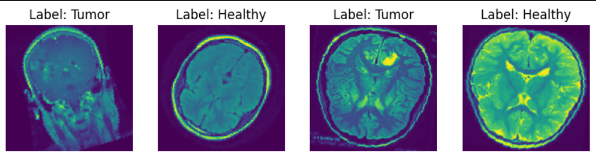

# CNN-BrainTumorDetection
Convolutional neural network created with PyTorch to detect and classify brain tumors from MRI scans.

    Created by Rafael A.H. in Oct. 2024
    
    Dataset by Preet Viradiya from Kaggle 2021:
      https://www.kaggle.com/datasets/preetviradiya/brian-tumor-dataset?resource=download&select=metadata.csv

- This CNN uses the Densely Coonnected Neural Networks architecture to connect all layers within the denseblocks  
- The data is prepared with random rotatiional and flips transformations  
- The data is prepared with single channel graayscale images transformation

Some tests

    
- The model is build with 1 channel and a classic block configuration (6, 12, 24, 16) of 4 Denseblocks  
- The model achieved 97% of accuracy with the next training parameters:  
  Dataloaders with a batch size of 32:
    
    *Number of samples:  4148*  
    *Training samples:  2904*  
    *Validation samples:  1244*

  Training parameters

    *Epochs: 15* 
    *Criterterion: Cross Entropy Loss*  
    *Optimizer: Adam*  
    *Learning Rate upadater: ReduceLROnPlateau*

-The model is ready to use for detecting brain tumors in MR Scans

